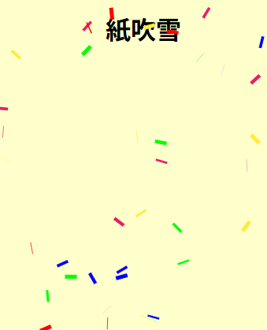

# confetti

## 概要

JavaScriptで紙吹雪のアニメーションを描きます。



紙吹雪の紙をDOMの`<div>`要素として追加し、追加・移動・削除を繰り返します。


## コード

```html
<!DOCTYPE html>
<html lang="ja">
<head>
    <meta charset="UTF-8">
    <meta name="viewport" content="width=device-width, initial-scale=1.0">
    <title>confetti</title>
    <style>
        body {
            position: absolute;
            margin: 0;
            padding: 0;
            width: 100vw;
            height: 100vh;
            overflow: hidden;
            background-color: #ffffcc;
        }
        .confetti-piece {
            position: absolute;
            width: 15px; height: 5px; /* 短冊みたいな */
            pointer-events: none;
            will-change: transform; /* パフォーマンス向上 */
        }
    </style>
</head>
<body>
    <h1 style="text-align: center;">紙吹雪</h1>

    <script>
        let confettiData = [];
        // 紙吹雪の最大数を制限（多すぎるとDOM操作が重くなるため）
        const confettiCount = 100;
        const confettiColors = ['#ff0000', '#00ff00', '#0000ff', '#ffeb3b', '#e91e63'];

        // パフォーマンス向上のため、Date()ではなくperformance.now()を使用
        let lastTimestamp = performance.now();

        // 紙吹雪を描画する
        const drawConfetti = (currentTimestamp) => {
            // 前回のフレームからの経過時間を計算（ミリ秒）
            const diffTime = currentTimestamp - lastTimestamp;
            lastTimestamp = currentTimestamp;

            // 1. 紙吹雪の生成
            if (confettiData.length < confettiCount && Math.random() < 0.6) {
                const div = document.createElement('div');
                div.className = 'confetti-piece';
                div.style.backgroundColor = confettiColors[Math.floor(Math.random() * confettiColors.length)];

                document.body.insertBefore(div, document.body.children[0]);

                confettiData.push({
                    div: div,
                    x: Math.random() * window.innerWidth,
                    y: -20,
                    time: Math.random() * 100, // 開始時間をバラけさせる
                    speed: 2 + Math.random() * 2 // 個別に速度を持たせる
                });
            }

            // 2. 紙吹雪の移動と削除。要素の削除に備えて逆順に走査する
            for (let i = confettiData.length - 1; i >= 0; i--) {
                const item = confettiData[i];

                // 経過時間に基づいた更新
                item.time += diffTime * 0.005;
                item.y += item.speed;
                item.x += 2 + Math.sin(item.time) * 1; // 左右の揺れ

                // 画面外（下）に出たら削除
                if (item.y > window.innerHeight) {
                    item.div.remove(); // モダンな削除方法
                    confettiData.splice(i, 1);
                    continue;
                }

                // 右端に来たら左端に移動
                if (item.x > window.innerWidth - 15) {
                    item.x = 0;
                }

                // 表示位置と回転の更新
                // transformにまとめることで描画負荷を軽減
                const rotate = item.time * 20;
                const scaleY = Math.sin(item.time);
                item.div.style.transform = `translate3d(${item.x}px, ${item.y}px, 0) rotate(${rotate}deg) scaleY(${scaleY})`;
            }
        };

        const render = (timestamp) => {
            drawConfetti(timestamp);
            window.requestAnimationFrame(render);
        };

        // アニメーション開始
        window.requestAnimationFrame(render);
    </script>
</body>
</html>
```
